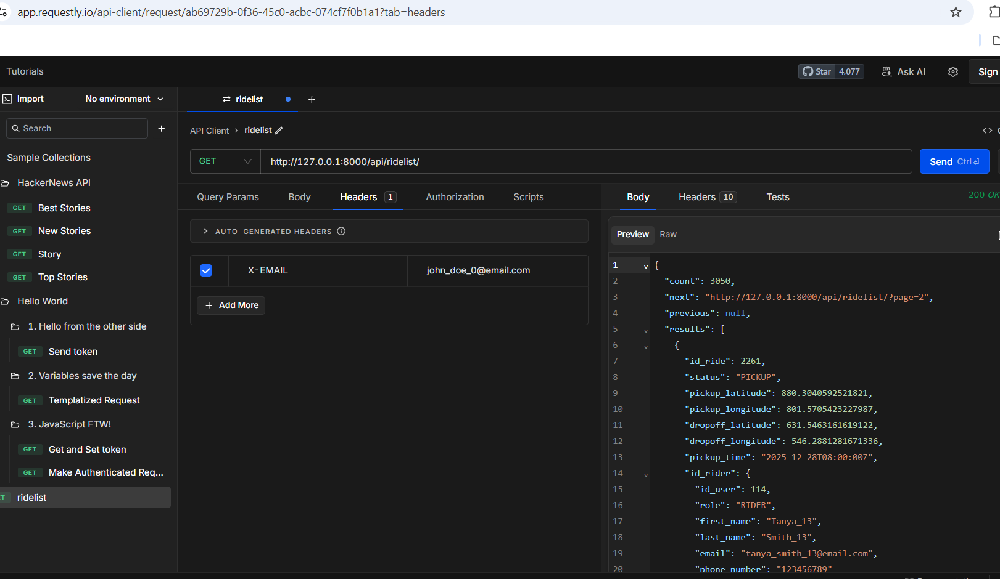
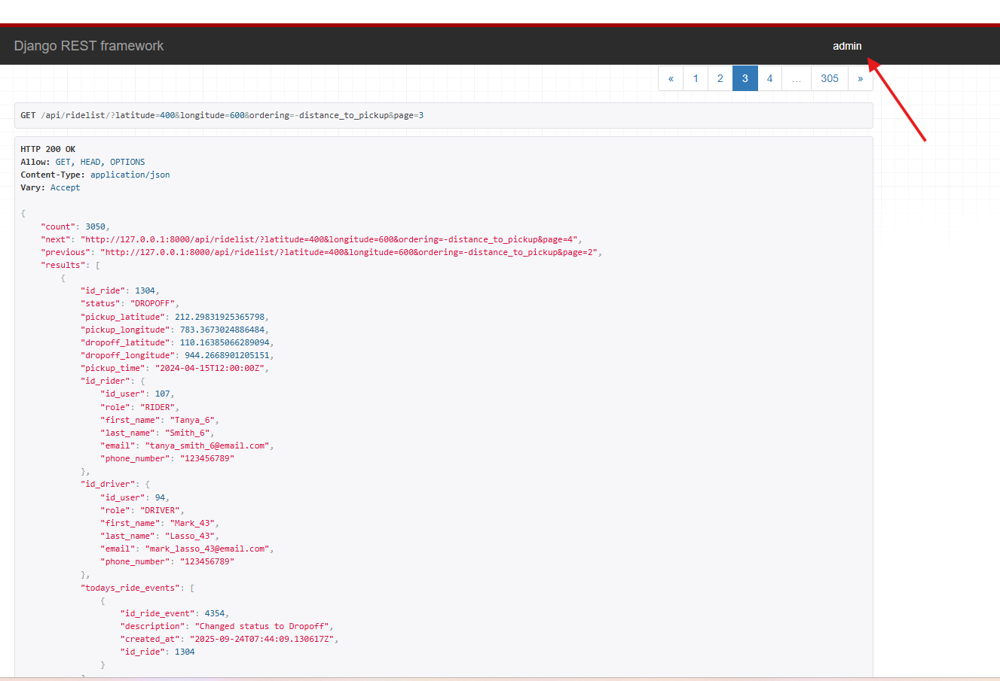
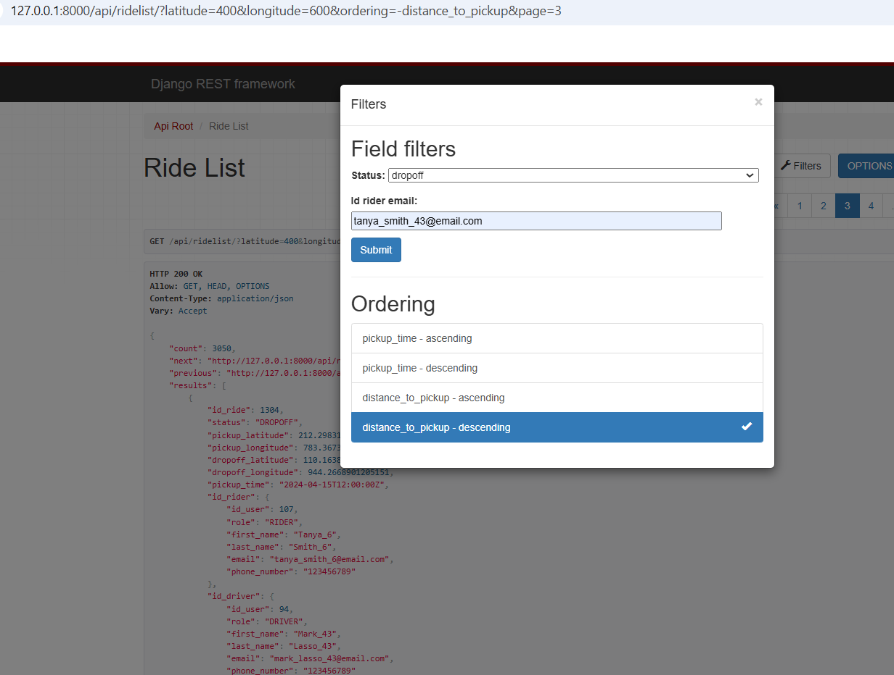
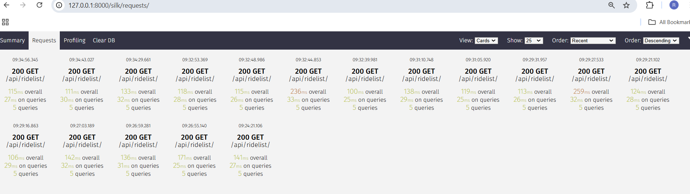
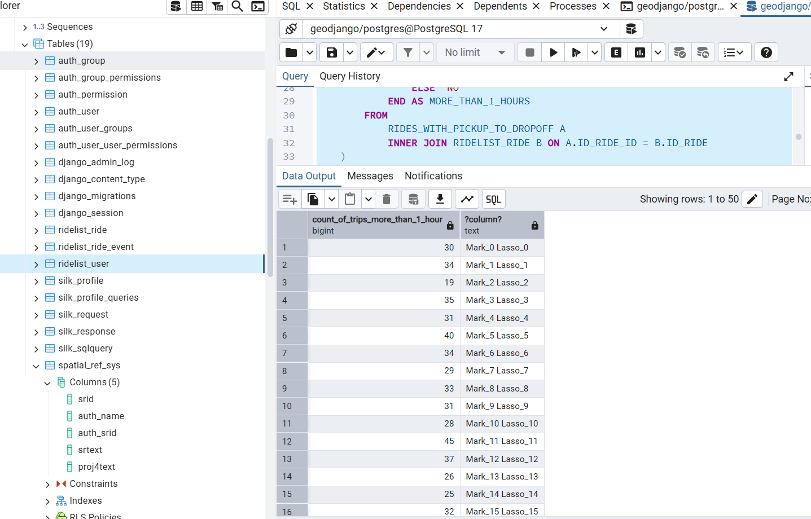

# WingzPH

A solution for managing ride information using django rest framework.

## Table of Contents

1.  [About the Project](#about-the-project)
2.  [Features](#features)
3.  [Getting Started](#getting-started)
4.  [Prerequisites](#prerequisites)
5.  [Installation](#installation)
6.  [Bonus Question](#bonus-question)

## About the Project

This is an API that returns a list of rides, riders, drivers and ride events associated with the ride. It utilizes DRF's
serializers and viewsets. It also supports filtering, ordering and pagination.

The API is accessible and browsable via `/api/ridelist/`. Please see Authentication on [Features](#features) for authentication requirements.

## Features

*   Authentication: Only users with role = 'admin' can access the API. We applied two solutions, whichever is satisfied first.\
```CustomHeaderAuthentication``` : A custom header `X-EMAIL` is **required** in the request.\

```SessionAuthentication``` : The User must be a **Django admin** user.

- Models: `User, Ride, Ride_Event`
* Utilize DRF features: \
**Filters** - Ride.status, Ride.id_rider_email\
```/api/ridelist/?status=DROPOFF&id_rider__email=tanya_smith_43%40email.com```\
**Ordering** - Ride.pickup_time, Ride.distance_to_pickup (given longitude and latitude as input in the API)\
```/api/ridelist/?ordering=-distance_to_pickup&longitude=600&latitude=400```\
**Pagination** - 10 entries per page\
```/api/ridelist/?latitude=400&longitude=600&ordering=-distance_to_pickup&page=3```

- Optimization and minimize SQL Queries - `django_silk` is enabled by default for profiling\
`/silk/`

## Getting Started

### Prerequisites

*   Django
*   PostgreSQL Database

### Installation

1. Install and download Python from https://www.python.org/downloads/
2. Create and activate virtual environment
3. Clone the repository:
    ```bash
    git clone https://github.com/Chichigo123/WingzPH.git
	```
4. Install requirements. `pip install -r requirements.txt`
5. Install geodjango https://docs.djangoproject.com/en/5.2/ref/contrib/gis/tutorial/#setting-up.
This project **requires** spatial database **PostgreSQL (with PostGIS)**. Please follow the platform-specific instructions in the official django site.
https://docs.djangoproject.com/en/5.2/ref/contrib/gis/install/#platform-specific-instructions
6. Apply migrations\
`python manage.py makemigrations`\
`python manage.py migrate`
7. Run project\
`python manage.py runserver`

### Scripts
After migrations have been applied the first time, you can use these helper scripts
to reset and populate the tables with test data.

* `reset_db.sh` - Resets the table User, Ride and Ride_Events
+ `clear_and_populate.sh` - Resets the table User, Ride and Ride_Events then populates the tables
* `python manage.py clear_ridelist_tables` - Clears Ride and Ride_Event tables
+ `python manage.py create_bulk_user` - Creates test users
* `python manage.py create_bulk_rides` - Creates test rides and ride_events

### Bonus Question

Returns the count of Trips that took more than 1 hour from Pickup to Dropoff and we want this by Month and Driver.

_Due to time constraint, this query only returns the count of trips > 1 hour and the driver overall (not monthly)_ 
```
WITH
	RIDES_AND_DRIVER_WITH_TRIPS_MORE_THAN_HOUR AS (
		WITH
			RIDES_WITH_PICKUP_TO_DROPOFF AS (
				SELECT
					ID_RIDE_ID,
					MIN(CREATED_AT) AS MIN_TIMESTAMP,
					MAX(CREATED_AT) AS MAX_TIMESTAMP
				FROM
					RIDELIST_RIDE_EVENT
				WHERE
					DESCRIPTION = 'Changed status to Pickup'
					OR DESCRIPTION = 'Changed status to Dropoff'
				GROUP BY
					ID_RIDE_ID
				ORDER BY
					ID_RIDE_ID
			)
		SELECT
			A.ID_RIDE_ID,
			B.ID_DRIVER_ID,
			CASE
				WHEN EXTRACT(
					EPOCH
					FROM
						(MAX_TIMESTAMP - MIN_TIMESTAMP)
				) / 3600 > 1 THEN 'Yes'
				ELSE 'No'
			END AS MORE_THAN_1_HOURS
		FROM
			RIDES_WITH_PICKUP_TO_DROPOFF A
			INNER JOIN RIDELIST_RIDE B ON A.ID_RIDE_ID = B.ID_RIDE
	)
SELECT
	COUNT(A.ID_DRIVER_ID) AS COUNT_OF_TRIPS_MORE_THAN_1_HOUR,
	B.FIRST_NAME || ' ' || B.LAST_NAME
FROM
	RIDES_AND_DRIVER_WITH_TRIPS_MORE_THAN_HOUR A
	INNER JOIN RIDELIST_USER B ON A.ID_DRIVER_ID = B.ID_USER
WHERE
	MORE_THAN_1_HOURS = 'Yes'
GROUP BY
	A.ID_DRIVER_ID,
	B.FIRST_NAME,
	B.LAST_NAME
ORDER BY
	A.ID_DRIVER_ID;
```

